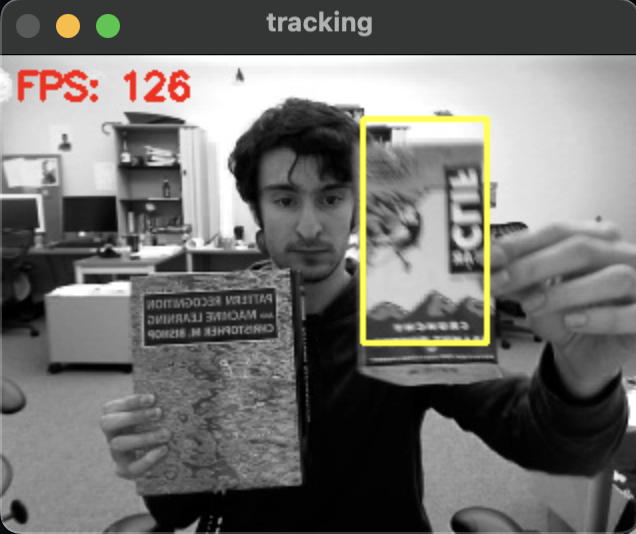

# KCF + FHOG Visual Tracker (Python / OpenCV)

A lightweight Python reimplementation of **Kernelized Correlation Filters (KCF)** with **FHOG** features and an **OTB-style evaluator**.  
It supports webcam, single-video, and folder-of-frames pipelines, saves predicted bounding boxes, and reports common OTB metrics (DP@20, CLE, AUC).

---

## Features

- **3 run modes**
  - **Webcam** with mouse ROI selection
  - **Video + initial bbox**
  - **Folder of frames + initial bbox**
- **FHOG** feature extraction (Numba-accelerated)
- **OTB-style evaluation**: Precision curve & DP@20, Success (IoU) curve & AUC, **CLE**
- **Robust I/O**
  - Accepts bbox/GT lines with commas, spaces, or tabs
  - Saves predictions as `x\ty\tw\th` (TSV)
  - Deterministic numeric sorting for frame filenames

---

## Project structure

```
.
├── ClifBar/                      # Sample OTB-style sequence
│   ├── img/                      # Frames (0001.jpg, 0002.jpg, ...)
│   ├── groundtruth_rect.txt      # GT: x y w h (comma/space/tab allowed)
│   └── preds.txt                 # Sample tracker output (tab-separated)
├── FHOG.py                       # FHOG feature extractor (Numba-accelerated)
├── KCF_Tracker.py                # KCF tracker implementation
├── evaluation_metric.py          # OTB-style metrics (precision/success/CLE/AUC)
├── Main.py                       # CLI entry: webcam, video, or frames pipeline
└── Sample                        # (Optional) screenshot/example image
```

> **Note**: The repository uses `Main.py` (capital **M**). On case-sensitive filesystems keep this exact filename.

---

## Installation

Tested with **Python ≥ 3.8**.

```bash
# (recommended) create a virtual env
python -m venv .venv
source .venv/bin/activate        # Windows: .venv\Scripts\activate

# install dependencies
pip install numpy opencv-python numba
```

If you run in a headless environment, use `opencv-python-headless`. GUI windows (for webcam/video visualization) require a desktop session.

---

## Usage

`Main.py` exposes three modes. Run `-h` for help.

```text
usage: Main.py {1,2,3} [--camera N] [--video PATH] [--frames DIR]
                [--bbox X Y W H | --bbox-file FILE | --gt FILE]
                [--save FILE]
```

### 1) Webcam (select ROI with mouse)
Start the camera, **drag left mouse** to set the initial box, **right click** to recenter, **q/Esc** to quit.

```bash
python Main.py 1 --camera 0 --save preds.txt --gt /path/to/groundtruth_rect.txt
```

### 2) Single video + bbox
Use the first line of GT for initialization **or** provide an explicit bbox.

```bash
# init from GT
python Main.py 2 --video /path/to/video.mp4 --gt /path/to/groundtruth_rect.txt --save preds.txt

# or explicit bbox
python Main.py 2 --video /path/to/video.mp4 --bbox 143 125 30 54 --save preds.txt
```

### 3) Folder of frames + bbox
Ground-truth file can be comma/space/tab separated. Predictions are saved as TSV.

```bash
python Main.py 3 --frames ./ClifBar/img   --gt ./ClifBar/groundtruth_rect.txt   --save ./ClifBar/preds.txt
```

**Input formats**  
- A bbox line may use commas, spaces, or tabs. Only the first 4 numbers are read.  
- GT and predictions are interpreted as **top-left (x, y, w, h)**.  
- When evaluating, lengths are aligned by `min(len(GT), len(preds))`.

---

## Evaluation (OTB-style)

When `--gt` is supplied, the script prints precision/success curves, **DP@20**, **CLE**, and **AUC**.  
For the included **ClifBar** sample (KCF + FHOG), a typical run prints:



```
=== Evaluation (OTB-style) ===
Frames evaluated: 472
DP@20 (Precision @ 20px): 0.9852
Average CLE (px):         8.9028
AUC (Success):            0.5536
Precision curve (first 5): [0.0106 0.0742 0.1441 0.2309 0.2754] ...
Success curve (first 5):   [1. 1. 1. 1. 1.] ...
=============================
```

**Metrics**  
- **Precision curve / DP@T**: fraction of frames where center error < *T* pixels (DP@20 is common).  
- **CLE** (Center Location Error): mean Euclidean distance between predicted and GT centers.  
- **Success / AUC**: IoU-based success curve thresholded from 0.02→1.0; AUC is its mean.

---

## Tips & Troubleshooting

- **No predictions saved / tracker never initialized**  
  Ensure you created the ROI (webcam) or provided `--bbox/--bbox-file/--gt` (video/frames).
- **Slow FPS**  
  Use smaller template sizes (current default is 96) or lower-resolution inputs.
- **Headless/CI**  
  Use `opencv-python-headless` and avoid window display (or use mode 3 to only write predictions).
- **Frame ordering**  
  Frame files are numerically sorted so `img1.jpg, img2.jpg, ..., img10.jpg` are handled correctly.
  
---

## License

MIT (feel free to change to your preferred license).
